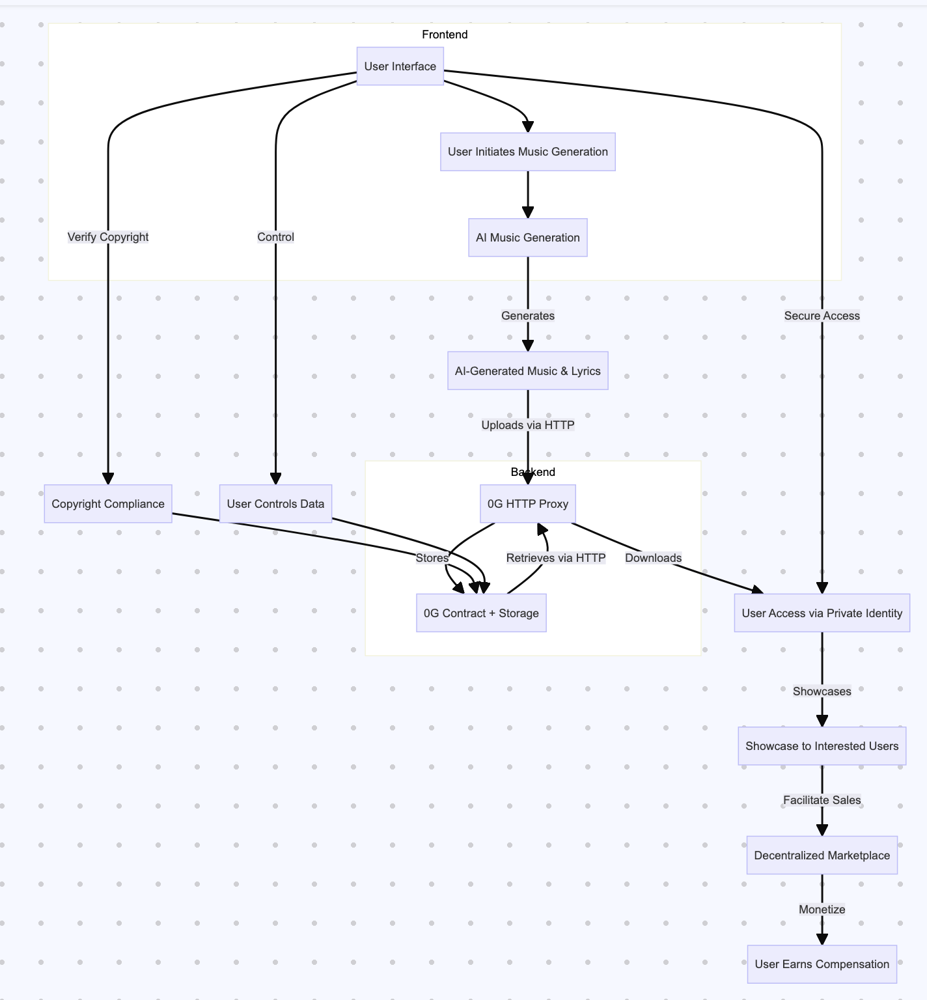

### SoundWaveX 系统架构图

**架构图说明：**

1. **AI Music Generation (AI音乐生成)**：
   - 通过AI生成独特且个性化的音乐和歌词。

2. **0G HTTP Proxy (0G HTTP代理)**：
   - 通过HTTP上传和下载音乐和歌词，充当中介。

3. **0G Contract + Storage (0G合约和存储)**：
   - 将音乐和歌词存储在0G区块链和存储系统中，确保数据的透明性和可追溯性。

4. **User Access via Private Identity (用户通过私人身份访问)**：
   - 用户使用私人身份安全地访问和下载音乐和歌词。

5. **Showcase to Interested Users (展示给感兴趣的用户)**：
   - 用户可以展示他们的音乐作品，吸引潜在的听众和买家。

6. **Decentralized Marketplace (去中心化市场)**：
   - 提供一个去中心化市场，用户可以在这里交易和变现他们的音乐资产。

7. **User Earns Compensation (用户赚取报酬)**：
   - 用户通过音乐的使用和销售获得报酬。

8. **Copyright Compliance (版权合规)**：
   - 通过区块链验证版权，确保音乐作品的知识产权得到保护。

9. **User Controls Data (用户控制数据)**：
   - 用户对其音乐作品和数据拥有完全控制权，符合自我主权身份的原则。

该架构图展示了SoundWaveX系统如何通过AI和Web3技术实现音乐创作、存储、分发和变现的全过程。
